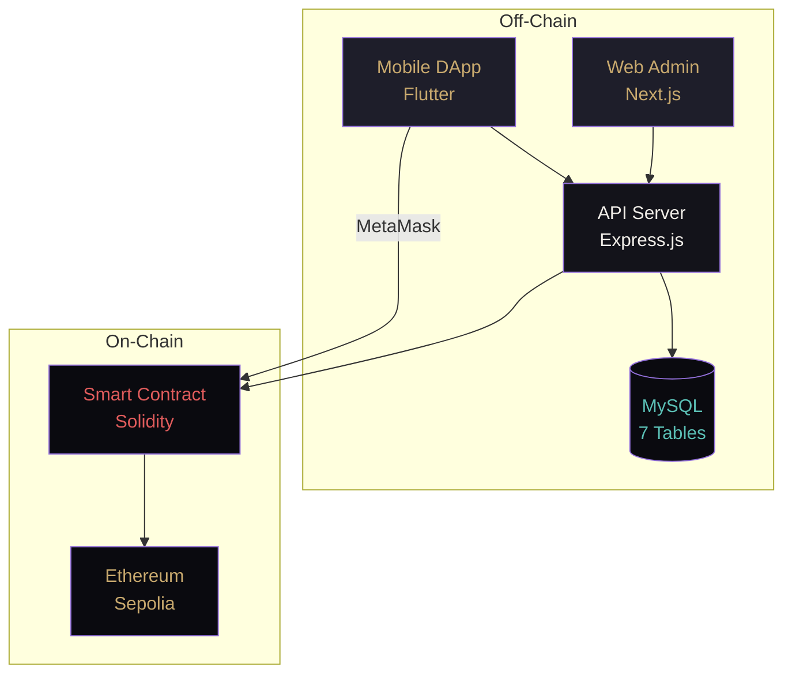
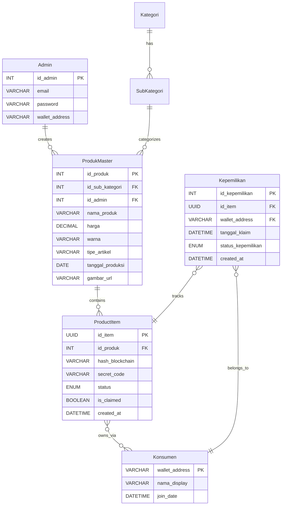

# 🔗 LUXCHAIN — Architecture Study Notes

> Platform verifikasi keaslian produk fashion mewah berbasis **hybrid blockchain** (Off-Chain MySQL + On-Chain Ethereum Sepolia)

---

## 📐 Monorepo — 4 Modules

| Module | Tech | Status |
|--------|------|--------|
| `web_app/` | Next.js 16 + React 19 + TS + TailwindCSS v4 | Bootstrapped, default page |
| `mobile_app/` | Flutter (Dart SDK ^3.11.5) | Initialized, default counter |
| `api_server/` | Node.js + Express.js v5 | Express installed, empty |
| `smart_contract/` | Solidity (Remix IDE) | Sample contracts, no Luxchain yet |

---

## 🏗️ Hybrid Architecture



---

## 🔄 3 Core Business Flows

### Flow A — Admin Minting
```
Form Input → API: Generate UUID + SHA-256 Hash → Smart Contract: mintToBlockchain()
→ MySQL: Store TxHash, status='minted'
```

### Flow B — Verification (Consumer)  
```
QR Scan → UUID → Parallel{ MySQL metadata + Smart Contract read }
→ Compare hash → "TERVERIFIKASI" or "PALSU"
```

### Flow C — Ownership Transfer
```
MetaMask Signature → Smart Contract: transferOwnership()
→ API Server sync → MySQL: Kepemilikan updated
```

---

## 🗄️ Database Schema (MySQL — 7 Tables)



---

## 🎨 Design System (Luxury Gold, Dual Mode)

**Light Mode (`:root`):**
| Color         | Hex                         | Usage |
|---------------|-----------------------------|-------|
| Warm Cream    | `#faf8f4`                   | Primary background |
| White         | `#ffffff`                   | Card, popover |
| Cream Panel   | `#f0ebe0`                   | Secondary, muted |
| Gold          | `#b8963e`                   | Primary accent, buttons, ring |
| Dark Brown    | `#2a2520`                   | Text utama |
| Warm Grey     | `#8a8078`                   | Text non-aktif |
| Red           | `#d44040`                   | Errors, destructive |

**Dark Mode (`.dark`):**
| Color         | Hex                         | Usage |
|---------------|-----------------------------|-------|
| Deep Dark     | `#0a0a0f`                   | Primary background |
| Dark Elevated | `#13131a`                   | Card, popover |
| Dark Panel    | `#1e1e2a`                   | Secondary, input bg |
| Gold          | `#c8a96e`                   | Primary accent, buttons, ring |
| Warm White    | `#f0ede8`                   | Text utama |
| Grey Purple   | `#7a7a96`                   | Text non-aktif |
| Coral Red     | `#e05c5c`                   | Errors, destructive |
| Teal          | `#5bbfb5`                   | Success, verified |

**Fonts**: Inter (headings + body), Roboto Mono (wallet addr, hashes, UUID)

---

## 🖥️ Web Admin Screens (6 halaman)

| # | Screen | Key Elements |
|---|--------|-------------|
| 1 | **Login** | Center card, username/password, "LOGIN" button |
| 2 | **Dashboard** | Sidebar nav (Dashboard, Products, Transactions, History) |
| 3 | **Product List** | Table: Image, SKU, Name, Brand, Token ID, Status, Action + "Tambah Produk Baru" |
| 4 | **Minting Form** | Metadata form + Image Upload + "MINT TO BLOCKCHAIN" button |
| 5 | **Transactions** | Table: Tx Hash, From/To Wallet, Product ID, Type, Date, Status + filters |
| 6 | **System History** | Timeline log: timestamps, actions, blockchain confirmations |

---

## 📱 Mobile DApp Screens (9 halaman)

| # | Screen | Key Elements |
|---|--------|-------------|
| 1 | **Splash** | Shield logo, "MULAI →" button |
| 2 | **Login** | "CONNECT METAMASK" (Sepolia), feature list |
| 3 | **Home** | Wallet address, NFT stats, "SCAN PRODUK", Koleksi Saya, Transaksi Terbaru |
| 4 | **Scan QR/NFC** | Camera viewport, toggle QR/NFC |
| 5 | **Verification Result** | Status banner (verified/fake), product details, gas fee info |
| 6 | **Klaim Produk** | Product card, tx details, "KONFIRMASI KLAIM" |
| 7 | **Transfer NFT** | Recipient wallet input, transfer details, "TRANSFER SEKARANG" |
| 8 | **TX Success** | Checkmark, Tx Hash, Block number, "KEMBALI KE HOME" |
| 9 | **Profil** | Wallet info, stats, settings, "DISCONNECT WALLET" |

---

## ✅ Ready to Code

> [!IMPORTANT]
> Semua dokumentasi telah dipelajari dan disimpan ke dalam Knowledge Item. Arsitektur hybrid, schema database, wireframe, design system, dan business logic sudah dicatat. Siap memulai development kapan saja.
